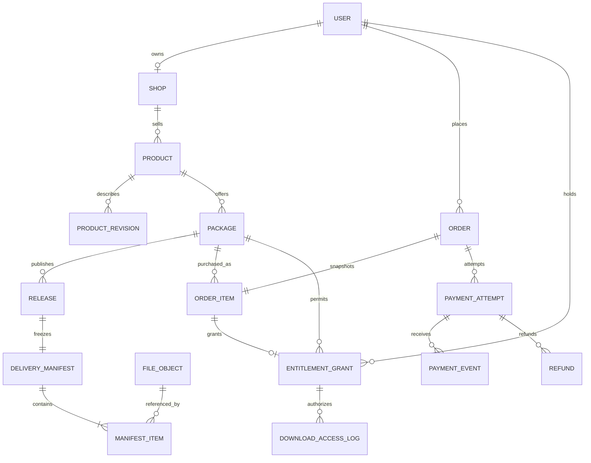
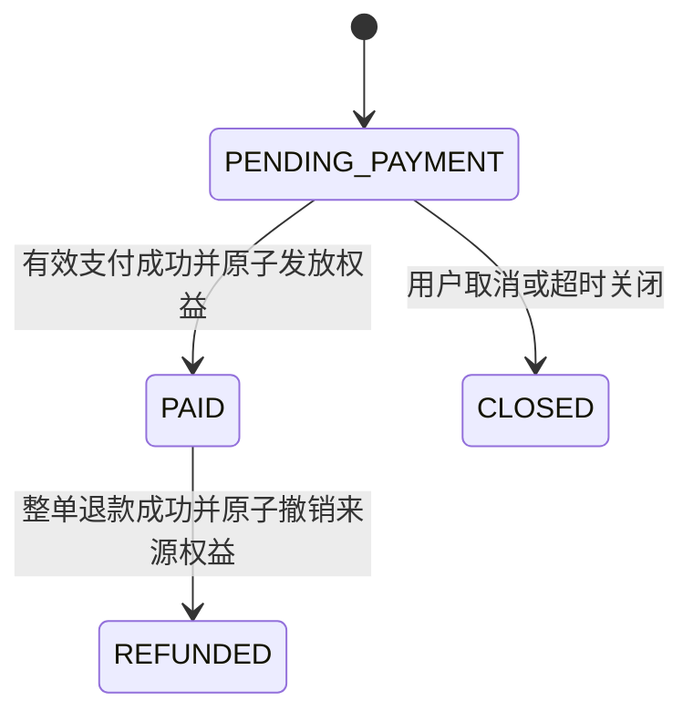
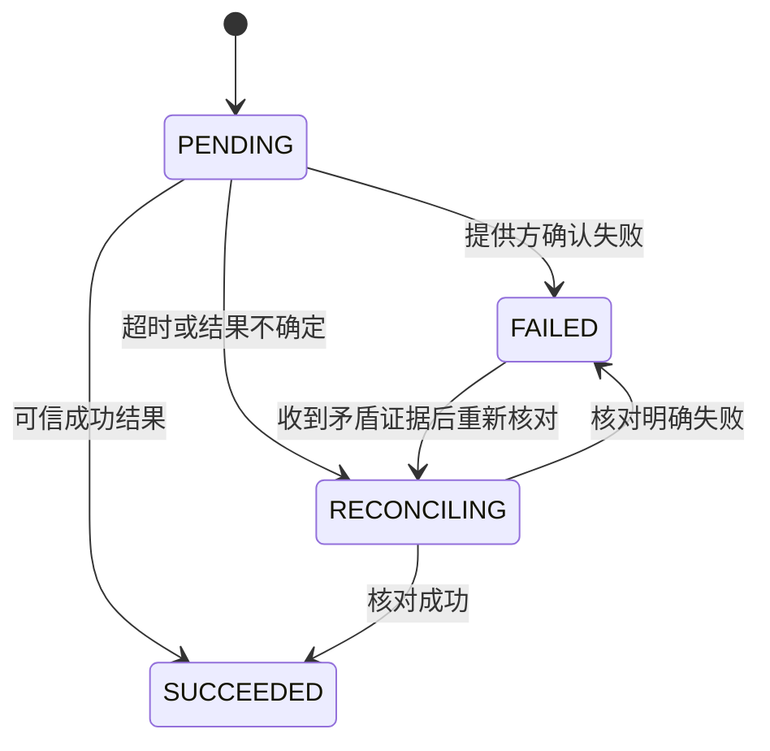
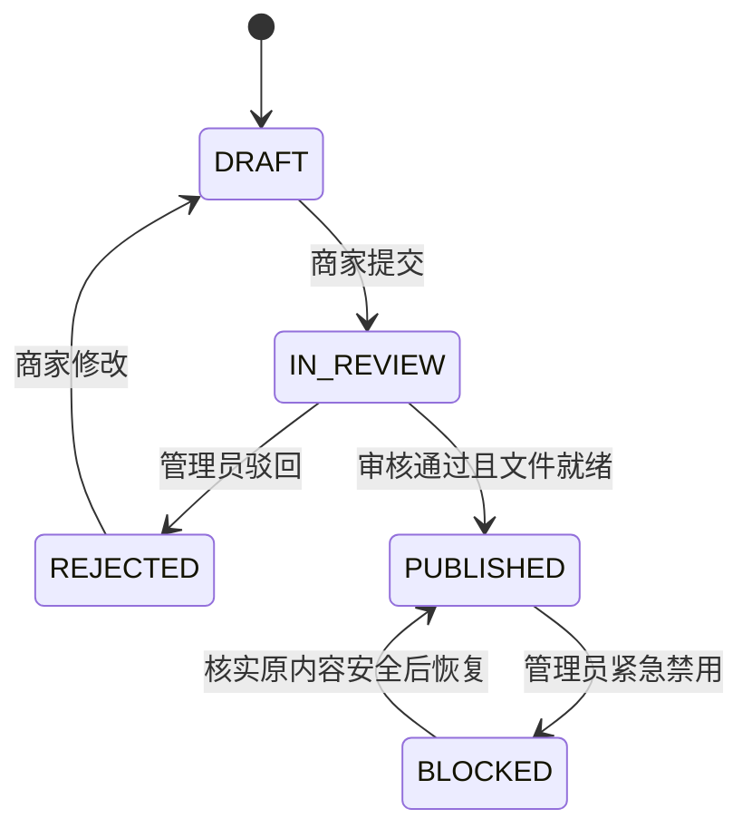
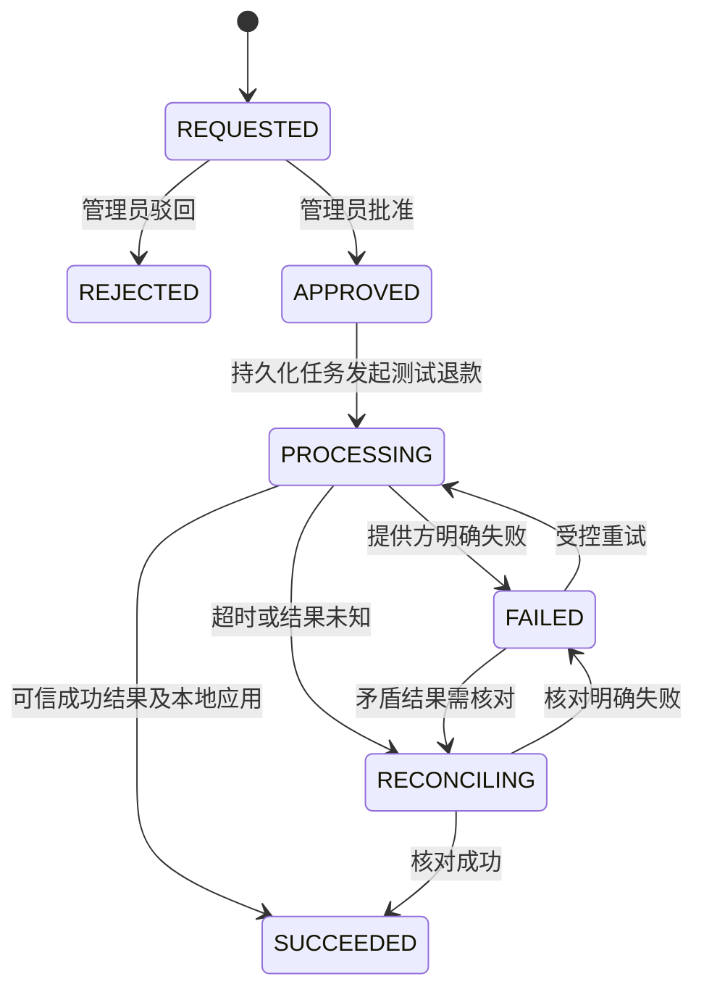
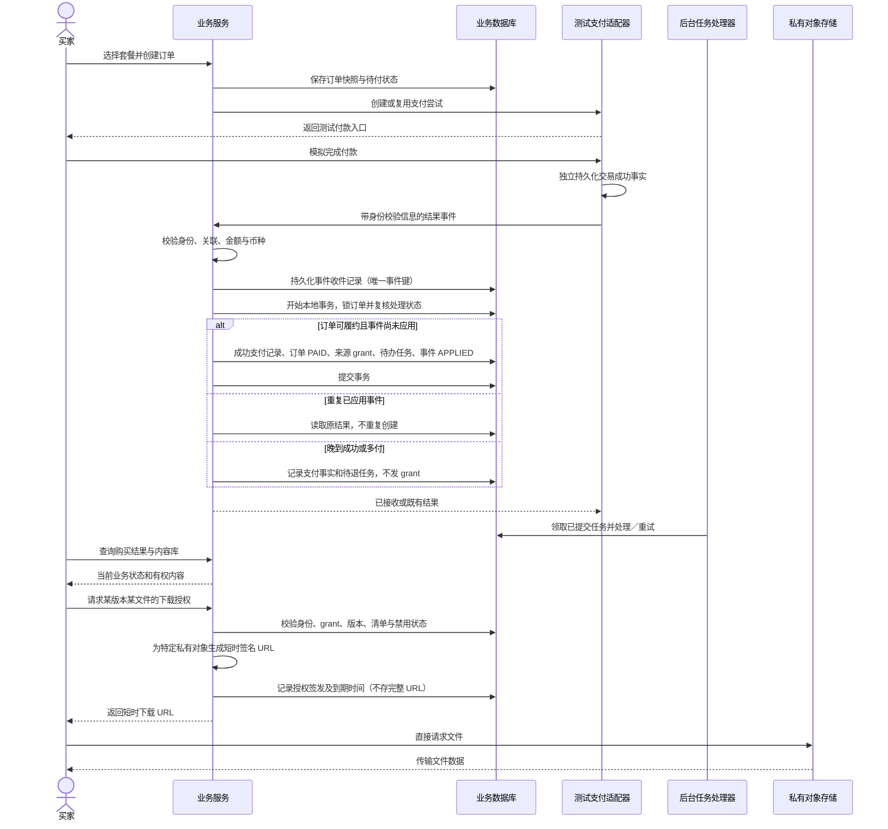

# 核心业务设计 V0.2.0

日期：2026-09-15。配套：[需求与总体设计](01-项目需求与总体设计-V0.2.0.md)。  
状态：领域与行为设计，不是已实现代码、最终 DDL 或测试报告。英文名是模型用语，不要求直接成为界面文案。

## 1. 领域模型

图表示关键关系。未购买而被拒绝的授权日志可以没有 grant；所有被拒绝的请求也应能记录。订单先于支付与 grant 存在。用户作为买家的身份不依赖是否拥有店铺。审计、审核记录和任务未画入，避免主图失焦。

### 1.1 模型边界与不变量

| 对象 | 本轮定义 | 关键不变量 |
| --- | --- | --- |
| Product | 稳定商品身份 | 归属店铺不由客户端任意改变 |
| ProductRevision | 描述、预览、使用说明修订 | 审核中的修订不覆盖已发布介绍 |
| Package | 基础包／完整包等售卖身份 | 不能通过改名把老权益指向另一个商品 |
| Release | 一个套餐的发布内容 | packageId 固定，发布后清单与文件不可变 |
| DeliveryManifest | 一个版本的完整交付清单 | 每个文件属于明确版本，不从当前商品目录推断 |
| FileObject | 私有对象与可信元数据 | 新内容新对象 key；READY 才能发布 |
| OrderItem | 购买快照 | 固定买家、套餐、商家、金额与策略 |
| EntitlementGrant | 某订单项发放的资格 | sourceOrderItemId 唯一，退款按来源撤销 |

Release 属于 Package 是本轮主动简化。不是“商品版本 × 全部套餐”二维矩阵。多个套餐可以引用同一 FileObject，但共享文件对象不意味着共享购买权限。

### 1.2 权益字段与访问路径

建议必要信息：grantId、userId、sourceOrderItemId、packageId、updatePolicy、status、grantedAt、revokedAt、revokeReason。首版 updatePolicy 仅 `ALL_RELEASES`；不因存在字段就建设策略引擎。

服务端从 releaseId 与 fileId 查询真实归属，不相信客户端传入的 userId、shopId 或任意存储 key。同名文件、同一文件被 Pro 复用，都不使 Basic 买家自动获得 Pro 其他内容。

访问条件可概括为：有效身份 AND 至少一个匹配套餐及策略的有效 grant AND 请求版本已发布 AND 清单含请求文件 AND 文件未禁用。普通店铺暂停／商品下架不直接否定老资格。

例：订单 A、B 各有一个 Basic grant，A 退款只撤 A；B 有效则访问继续。原支付事件在退款后重放，只返回已处理事实，不重建或激活 A 的 grant。

## 2. 状态机的共同约定

- 状态转移由明确业务操作触发，同时核对操作者权限、当前状态、关联对象和业务唯一性。
- 首版采用服务层状态规则、数据库条件更新／行锁和事务，不引入通用工作流引擎。
- 同一资源的并发操作按锁定后的状态裁决。涉及订单与支付／退款的处理统一锁顺序，详细 SQL 设计时固定顺序，避免各模块互相反向加锁。
- 成功状态不因晚到的失败事件倒退；冲突事件留记录并核对。
- 业务状态与消息处理状态分开：支付成功是资金事实，事件尚未应用是处理事实。

## 3. Order：交易承诺

PAID 表示该订单已成功收款且本地权益发放已提交，不表示“文件已下载”。不增加无独立含义的 PAYING 或 COMPLETED；支付进行过程看 PaymentAttempt，退款审核过程看 Refund。

| 当前与触发 | 允许方及校验 | 结果、重复与失败 |
| --- | --- | --- |
| 创建订单 | 买家；套餐可售，服务端定价，有可交付版本 | PENDING_PAYMENT；重复请求以买家请求键复用订单 |
| PENDING_PAYMENT 收到付款成功 | 验证后的支付处理器；金额、币种、关联、期限和销售承诺符合规则 | 本地事务更新 PAID、创建 grant；失败全部回滚 |
| PENDING_PAYMENT 取消／过期 | 本人或定时任务；锁定后检查仍未付款 | CLOSED；重复关闭无额外副作用 |
| PAID 退款成功 | 验证后的退款处理器 | REFUNDED 并撤本订单 grant；重复不再撤其他来源 |
| CLOSED 收到晚到付款 | 支付处理器核实资金事实 | 订单仍 CLOSED，不发 grant；登记待退处理 |
| REFUNDED 重放付款成功 | 支付处理器识别已处理交易 | 不回到 PAID、不重新发 grant |

订单关闭与支付成功竞争同一订单锁：支付先提交则不能再普通关闭；关闭先提交则晚到付款进入待退。关闭订单的晚到款退款成功后，订单仍 CLOSED，PaymentAttempt 记录成功事实，Refund 记录款已退回，不伪造订单曾履约。

## 4. PaymentAttempt：支付尝试与资金事实

SUCCEEDED 不因为退款变成 FAILED；退款使用独立记录。超时不是资金失败。成功后的重复或过期失败通知只记录，不回退状态。

| 操作 | 校验与行为 |
| --- | --- |
| 创建支付尝试 | 订单待付且未过期，同订单只允许一笔未决尝试；客户端重复点击返回既有尝试 |
| 发起再次尝试 | 上次明确失败且订单仍可付；不能在结果未知时任意新开付款 |
| 接收结果 | 校验适配器身份、providerEventId、providerTransactionId、订单、金额和币种 |
| 同事件重复 | 唯一事件键识别后返回既有处理结果；若旧记录仍待处理，不把它误判为“已完成” |
| 同交易不同事件 ID | 交易唯一性与订单已关联成功交易校验避免重复发 grant |
| 同订单出现另一笔成功交易 | 第一笔已履约则新交易进入超额付款待退，不新增权益 |
| 结果未知 | 持久化核对任务，查询同一提供方交易，禁止靠手动置订单 PAID 跳过流程 |

测试适配器应能持久化自己的交易事实，独立于业务事务：否则业务回滚时“付款成功”也一起消失，无法验证真实的结果丢失与恢复问题。它可在同进程采用独立事务和逻辑模块，不需要联网到真实支付商。

## 5. Release：文件发布生命周期

- 商家只能操作本店套餐的 DRAFT／REJECTED 内容；提交后冻结候选内容，修改需退出该次审核再生成草稿修订。
- 审核通过时再次检查 manifest、文件 READY 状态、店铺发布权限和套餐归属，再提交发布事务。
- PUBLISHED 之后只能调整访问状态，不能修改 manifest 或替换文件。修复文件要创建新 Release；BLOCKED 恢复仅针对原内容确认可用的情况。
- 一个套餐可保留多个 PUBLISHED 版本；“当前推荐版本”只是展示选择，不删除历史版本。
- BLOCKED 版本不新签发授权。既有短时 URL 的窗口遵守主文档边界；不能仅凭数据库标记声称已阻断所有现存下载。
- ProductRevision 的审核是介绍信息审核，Release 的审核是文件交付审核；UI 可合并显示进度，但模型不能混称“商品版本”。

## 6. Refund：退款审核与处理

| 规则 | 本轮约定 |
| --- | --- |
| 申请条件 | 买家本人、普通已付款订单；首版整单金额，服务端计算；活动申请唯一 |
| 审批者 | 管理员，必须有理由和操作记录；商家不能直接伪造退款成功 |
| 发起外部退款 | 创建退款任务与 APPROVED 同事务；后台以稳定退款请求键调用适配器 |
| 成功处理 | 本地事务内 Refund SUCCEEDED、普通订单 REFUNDED、撤销该订单 grant、创建通知任务 |
| 失败处理 | FAILED 不撤权；重试保持同一业务退款身份，具体提供方重试规则由适配器负责 |
| 未知处理 | RECONCILING，查询原请求而非盲目另发退款；后台超时不证明退款失败 |
| 晚到付款退回 | 系统创建 SYSTEM_LATE_PAYMENT 原因的自动批准退款，留痕；订单维持 CLOSED，无 grant 可撤 |
| 重复／乱序 | SUCCEEDED 不回退；无法关联或前置资金事实未核实的事件进入待核对记录，不先撤其他权益 |

当退款事件早于支付业务应用到达时，先核对该支付交易与退款事实，再在同一业务应用过程中形成最终订单／grant 状态；不先对外开放下载再等待撤权。迟到支付事件不得推翻已核实退款结果。

## 7. 下单—付款—授权下载时序

签名常由存储 SDK 在服务端本地生成；时序不假定必须请求对象存储签名 API。下载授权记录提交失败时不返回 URL。签名到返回之间发生撤权仍存在竞态窗口，使用短有效期限制，不承诺零窗口。

### 7.1 事件处理与事务边界

有效事件先作为 Inbox 收件记录持久化，再应用业务事务。收件记录状态可为 RECEIVED、APPLIED、NEEDS_REVIEW。提供方收到成功应答表示已可靠接收，不一定代表所有异步通知已完成；前端查业务订单状态。

核心应用事务包含：锁定订单并校验、确认支付尝试成功、订单状态、来源 grant、必要后台任务、事件 APPLIED。任一失败则整组回滚，Inbox 仍待处理，由重投或核对任务恢复。

这比外部评价中的“所有事件只在同一事务内插入”多一层可靠收件，但仍是单数据库；不增加消息队列。提供方事实与主业务必须分开，主业务内部可原子修改的部分则不拆成不必要的异步步骤。

唯一性至少考虑：提供方事件键、提供方交易键、订单项来源 grant、任务业务键。仅锁 providerEventId 不足以防止同交易换事件 ID 后重复应用。收到重复 RECEIVED 事件应安排继续处理，而非返回“已经发放”。

### 7.2 后台任务不是资金事实

任务建议状态：PENDING、RUNNING、RETRY_WAIT、SUCCEEDED、NEEDS_REVIEW。含业务键、尝试次数、下次执行时间、领取租约、最近错误。领取与完成检查处理者令牌；崩溃后租约超时可以重新领取。

执行采用至少一次语义，通知等副作用必须按业务键去重；支付／退款调用使用稳定请求标识和结果核对。后台表加一个 SUCCESS 字段不等于外部调用恰好一次。

NEEDS_REVIEW 可查看原因、核对和受控重试。处理记录关闭不等于资金问题已解决，不允许用“人工关闭任务”抹掉未退金额。记录处理结论与关联退款证据。

任务机制从 C1 为必要恢复提供最小能力，C2 再做完善管理界面和站内通知。没有实际用途时不为每笔交易创建空任务。

## 8. 下载记录的证据边界

DownloadAccessLog 记录用户、所选 grant（若有）、套餐、版本、文件、请求时间、授权时间、到期时间、ALLOW／DENY 与原因。多条有效 grant 时记录本次选择的一条，不把它当作用户唯一资格。

直连下载模式下，后端知道的是自己签发了凭证。对象存储访问日志、代理发送字节或客户端回报只能提供各自范围的证据，不单独保证用户已经完整保存文件。因此不设置语义含糊的 download_success，也不把签发次数作为完成下载次数。

## 9. 设计验证与下一步

逐项对应主文档 A01—A14 验收。本轮只完成文档关系和状态一致性检查，未实现接口、事务或支付模拟，不能声称测试通过。

下一步先做核心页面原型与规则复核。C1 实现前细化唯一约束、事务锁顺序、接口错误语义、文件大小与格式限制、测试适配器故障注入方式。未确认真实支付前，不引入特定支付商的签名或重试协议假设。
