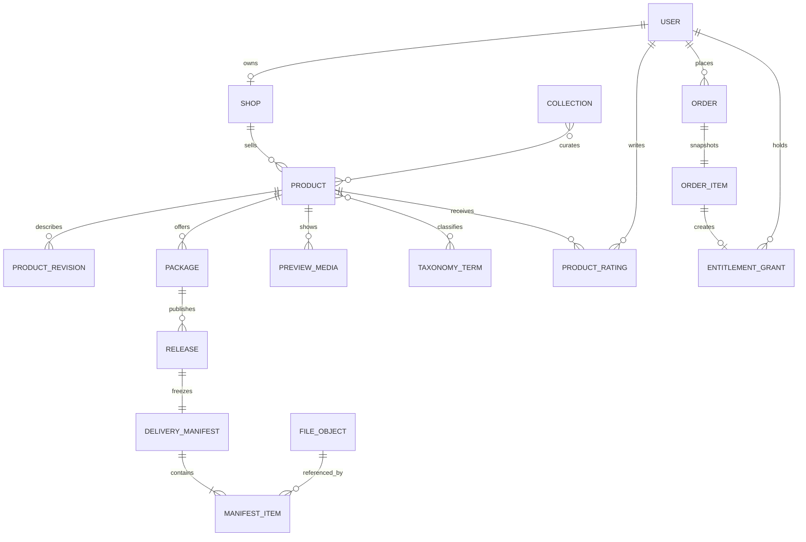
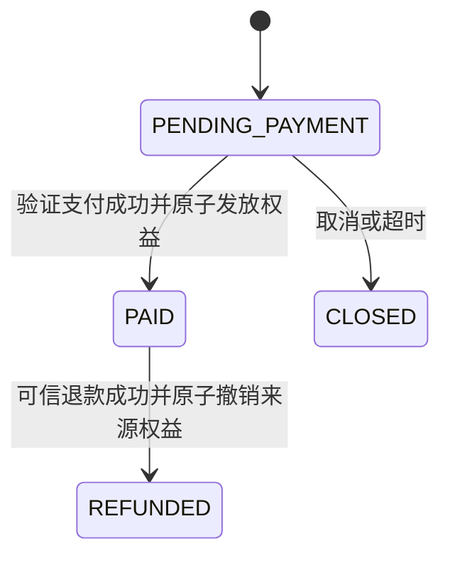
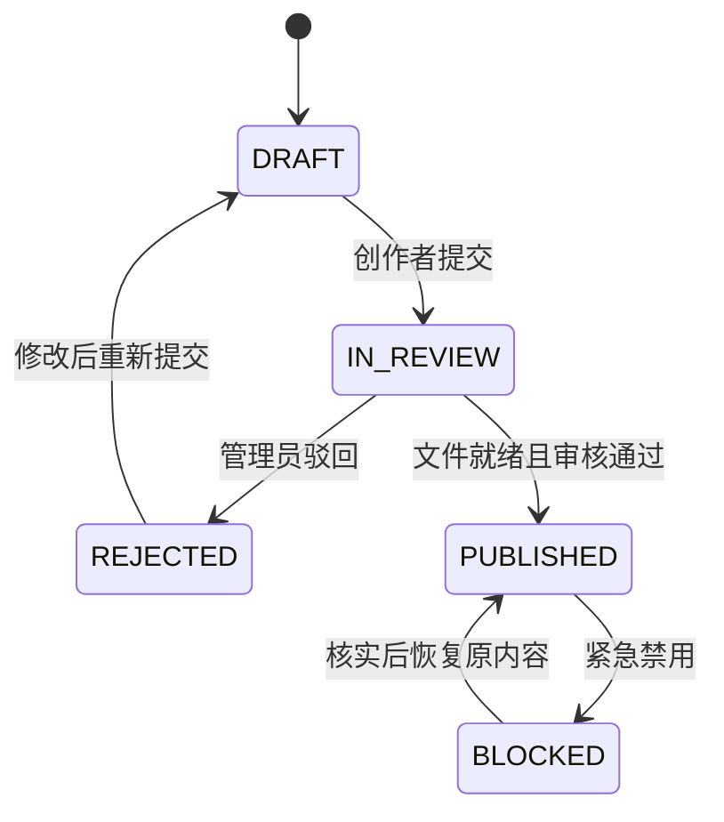

# Meteor：核心业务设计 V0.4.0

日期：2026-09-26  
状态：当前有效、暂时稳定的领域与行为设计。它继承 V0.3.0 的订单、支付、退款、权益与下载正确性规则，并补齐作品集合、分类与评分边界；不是 DDL、接口实现或测试报告。

## 1. 领域模型与不变量

### 1.1 交易与交付

- `Product` 是稳定的交易身份；`ProductRevision` 保存标题、描述、分类、标签与公开展示信息的修订。
- `Package` 是稳定售卖档位；`Release` 属于一个 Package。一个 Release 对应一份完整、不可变的 `DeliveryManifest`，可以含多个文件与格式。
- 已发布版本、清单和正式文件不原地覆盖；修复或增加文件必须创建新 Release。多个套餐可复用同一文件对象，但不共享购买资格。
- 公开 `PreviewMedia` 与私有 `ReleaseFile` 分离；任何未购买用户都不能通过预览路径得到正式文件或私有存储地址。
- 每一笔有效订单项创建一条来源明确的 `EntitlementGrant`。访问不是 `has_access` 布尔值：必须同时满足身份、有效来源权益、套餐策略、已发布且未禁用的版本、清单归属与文件可用。
- 首版策略为 `ALL_RELEASES`：买到某套餐后，可访问该套餐已发布且未禁用的历史与后续版本；不自动获得其他套餐。

### 1.2 发现层对象不改变授权

- `Collection` 是编辑／策展关系，包含标题、封面、说明、显式排序与可见状态；它可关联商品，但不产生权益、价格或交付文件。
- `Asset` 可以作为商品／系列的展示项存在，是否独立售卖由 Product 决定。展示项多于一张图不等于多次授权。
- 分类采用受控 `TaxonomyTerm`（一级分类、小类）；标签是可检索元数据。AI 可提出建议，只有经创作者确认或审核流程写入后才成为正式数据。
- Collection 的成员与排序来自明确记录，不能用图像相似度自动写入生产数据。

### 1.3 评分模型

- `ProductRating` 对 `(userId, productId)` 唯一，保存 score、首次评分时间、最近修改时间和资格快照／来源订单项引用。
- 写入评分时，服务端必须校验用户曾拥有或当前拥有可识别的有效购买来源；访客、未购买用户和跨账号请求一律拒绝。
- 商品卡片保存或查询聚合摘要 `ratingAverage`、`ratingCount`、分布。聚合是派生值，不能替代原始评分记录。
- 退款后的历史评分首版保留且不可再次修改；如需删除或隐藏，必须产生独立审核记录，不能静默改写计数。
- 文字评论、回复、举报与内容审核不属于 V0.4.0。

## 2. 权限矩阵

| 资源／操作 | 访客 | 买家 | 创作者 | 管理员 |
| --- | --- | --- | --- | --- |
| 公开商品、系列、预览 | 读 | 读 | 读 | 读／管理可见状态 |
| 创建订单、查看自己的订单 | — | 是 | 作为买家时是 | 按审计权限查看 |
| 内容库／下载授权 | — | 仅自己的有效权益 | 作为买家时仅自己的 | 受控排障，不直接替用户下载 |
| 商品草稿、Release、店铺订单 | — | — | 仅自己店铺 | 全局审核／处置 |
| 分类词表、Collection 平台精选 | — | — | 可提议或管理自己的系列 | 全局维护 |
| 评分 | — | 已购商品 | 已购商品 | 受控隐藏／处理 |

路由守卫与菜单隐藏只改善体验，绝不是授权。每个服务方法以身份、角色、资源归属和当前状态复核。

## 3. 状态机与事务规则

### 3.1 订单、支付、退款

- `PaymentAttempt` 独立记录 `PENDING`、`SUCCEEDED`、`FAILED`、`RECONCILING`，支付成功不因退款变成失败。
- 支付事件先持久化 Inbox，再用本地事务锁定订单，更新订单、支付尝试、Grant、必要任务与事件状态。提供方事件键、交易键、订单项来源 Grant 与任务业务键必须有唯一性约束。
- 关闭后的晚到付款记录真实资金事实，但订单不重新履约、不发 Grant，转入核对／待退。
- `Refund` 经过 `REQUESTED → APPROVED → PROCESSING → SUCCEEDED / FAILED / RECONCILING`；只有可信退款成功才撤销该订单项来源的 Grant。其他有效来源不受影响。

### 3.2 发布与文件

- 审核中的候选版本冻结；当前线上版本继续可用。
- 普通商品下架只停止新购；紧急文件／版本禁用停止新的下载授权。两者都不删除历史订单。
- 短时下载 URL 只在全部条件满足时签发；授权日志记录签发或拒绝，不把签发视为客户端下载完成。

## 4. 接口的状态表达

所有接口返回可供 UI 呈现的业务状态和稳定错误码；不把数据库异常、对象 key、完整签名 URL 或内部任务详情泄露给前端。

| 场景 | 至少需要表达 |
| --- | --- |
| 商品 | 可售／已拥有／停售、套餐、规格、版本摘要、评分摘要 |
| Collection | 主题、成员顺序、总数、分页游标、可见状态 |
| 目录 | 当前分类／小类／标签／排序、下一页信息、空结果而非错误 |
| 内容库 | 有效／撤销／文件禁用、更新、下载是否可请求 |
| 发布 | 草稿、文件处理、审核中、驳回原因、线上版本不受影响 |
| 评分 | 是否可评、我的评分、聚合摘要、资格失败原因 |

## 5. V0.4.0 验证清单

1. 重复支付事件、同交易不同事件 ID、事务中断、晚到付款与退款重放均不重复发放或恢复权益。
2. 一个商品的 Manifest 含多文件／多格式时，按实际清单授权；一个系列含多商品时，不越过商品与套餐边界。
3. 商品、系列、目录与搜索的公开信息不泄漏私有文件地址或敏感元数据。
4. 访客、买家、创作者与管理员的越权请求在服务端被拒绝；同一创作者不能读取其他店的数据。
5. 只有符合购买资格的用户能评分；重复评分只更新同一条记录；评分摘要与原始记录一致。
6. 分类／小类来自受控词表，标签与 AI 建议不会绕过创作者确认和审核。

V0.4.0 不以“已实现”表述上述规则。实现时仍需补充 MySQL 表结构、索引与锁顺序、接口请求／响应 DTO、错误码、迁移脚本和自动化测试。
