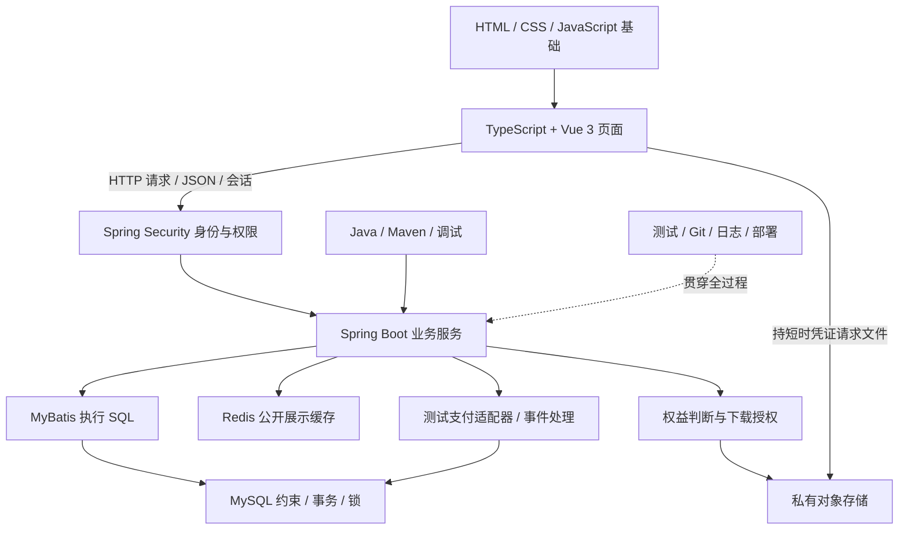

# Meteor：技术知识地图与项目学习路线

日期：2026-09-16。配套：[项目评估](05-项目评估与学习实施建议.md)、[业务设计](01-项目需求与总体设计-V0.3.0.md)、[核心模型](03-核心业务设计-V0.3.0.md)。

本轮交付为学习计划，下面的实现、实验和部署均为后续任务。此文提供完整路线，不要求一个月全部完成。用户补充基础后，日常执行优先采用 [一月冲刺计划](07-一月冲刺学习计划.md)；此处 M0—M7 用于查知识和对齐验收。时间根据实际完成速度调整。

## 1. 全局框架：一个操作穿过哪些技术

用一句话理解各层：页面表达操作；HTTP 搬运请求；后端判断规则；数据库保存事实并保护约束；对象存储保存文件；测试检查结果。AI 是学习和开发工具，项目本身不必先做 AI 功能。

学习依赖是：Java 基础 → HTTP 与 Spring MVC → SQL 和映射 → 登录隔离 → 事务和订单 → 私有交付 → 事件恢复 → 发布退款。前端沿 HTML／CSS／JS → TS → Vue 渐进穿插，不必先学完完整前端课程。

## 2. 技术栈与选型深度

“建议”表示学习路线的默认选择，不代表用户已逐项确认，更不代表已经安装或验证。版本在首次搭建时从官方兼容表确定并记录，此后尽量固定。

| 层次 | 本项目路线 | 取舍与学习范围 |
| --- | --- | --- |
| 语言与构建 | Java；Maven | 选与框架兼容的稳定 JDK；不同时学习 Gradle |
| 后端 | Spring Boot + Spring MVC | 按业务模块组织的单体；先理解依赖注入、请求处理与配置 |
| 安全 | Spring Security；建议 Session Cookie | 学认证、授权、密码哈希、CSRF；JWT／OAuth2 等有具体需求再增加 |
| 数据库 | MySQL／InnoDB；新环境核验 8.4 LTS，已有稳定 8.0 环境可沿用 | 先掌握 SQL、约束、事务、索引；固定实际版本，不同时学两套数据库 |
| 持久层 | 建议 MyBatis | SQL 显式可见，便于学习条件更新和锁；JDBC 先理解概念，不要求先写一套框架 |
| 数据迁移 | 建议 Flyway 的版本化 SQL 迁移 | 让新环境可重建，不依赖手工改表；初期只学 migrate、历史与校验 |
| 前端 | Vue 3 + TypeScript + Vite + Vue Router | 组合式 API、单文件组件；Pinia 仅在跨页共享状态出现时引入 |
| UI | 原型后选一个 Vue 3 组件库 | 会使用表单、反馈、对话框即可；CSS 基础仍要自己掌握 |
| 文件 | 私有对象存储及官方 SDK | 学 bucket、key、元数据、签名 URL；供应商留待 M4 核验，S3 文档仅作概念来源 |
| 支付与异步 | 测试适配器 + 数据库 Inbox／任务表 | 不接真实款项；MQ 先独立了解，不是交易成立的前提 |
| 缓存 | Redis + Spring Data Redis | 本月必学并完成实验，争取集成公开商品展示缓存；业务事实仍在 MySQL |
| 测试 | JUnit、Spring 测试、真实 MySQL 集成测试 | 容器可用时使用 Testcontainers；否则使用隔离测试库，不用 H2 代替关键锁行为验证 |
| 交付 | 本地 Git、日志；Linux 从第一周穿插，之后 Docker Compose／Nginx | 使用自己的虚拟机；先会运行与排错，再打包重现；不学 Kubernetes 集群作为开工条件 |

MyBatis starter 与 Boot／Java 有明确兼容组合，应查 [官方兼容表](https://mybatis.org/spring-boot-starter/mybatis-spring-boot-autoconfigure/) 和 [Boot 系统要求](https://docs.spring.io/spring-boot/system-requirements.html)，不能混用不同年代教程的依赖和配置。Vue 的构建与 TS 类型检查也应分别验证，参见 [Vue TypeScript 指南](https://vuejs.org/guide/typescript/overview)。

## 3. 每项技术的知识大纲

深度分三级：**起步必会**是开始对应小功能前要知道的内容；**项目内掌握**在做到对应功能时学习并验证；**暂缓**表示当前无需展开。不是要求一次背完。

### 3.1 Java：能读懂、修改和调试业务逻辑

- 起步必会：变量和流程、类与对象、接口、构造器、访问控制、List／Map／Set、泛型基础、枚举、异常和调用栈。
- 项目内掌握：BigDecimal 与金额规则、equals／hashCode、不可变快照、LocalDateTime 与 Instant 的区别、资源关闭、基础 IO、Lambda／Stream 阅读、依赖注入所需的接口思想。
- 到并发阶段再学：共享状态、线程与线程池、可见性／原子性概念；Java 内存锁与数据库锁的区别。不能用单进程 synchronized 替代数据库业务约束。
- 暂缓：复杂泛型技巧、并行流优化、JVM 调优、手写容器与反射框架。
- 过关：能独立表达一个订单允许／禁止的状态转移，读调用栈找到错误位置，解释金额为什么不用 double。

### 3.2 Web 与 HTTP：看懂一次请求发生什么

- 起步必会：客户端／服务端、URL、GET／POST、请求头／请求体、JSON、状态码、浏览器 Network 面板。
- 项目内掌握：Cookie／Session、同源与 CORS、HTTPS、超时、重试、业务幂等键、分页与参数校验、401／403／404 的语义；敏感资源返回策略应一致。
- 重点：超时说明调用者没有及时收到结果，不自动说明服务端没有执行；前端禁用按钮不构成幂等保证。
- 暂缓：HTTP/2 协议细节、网络框架源码、完整 OAuth 协议实现。
- 过关：把“点击购买 → 请求 → 服务端处理 → 响应丢失”画出来，说明为什么不能直接重做付款。

### 3.3 SQL 与 MySQL：先学数据约束，再学框架

- 起步必会：表／行／列、主键、外键、NOT NULL／UNIQUE／CHECK、增删改查、JOIN、排序、分页、聚合、金额和时间的数据类型。
- 项目内掌握：InnoDB、事务提交／回滚、隔离级别与 MVCC、快照读与当前读、行锁、条件更新、死锁与统一锁顺序、组合索引、EXPLAIN、迁移与种子数据。
- 秋招深化：B+Tree、聚簇／二级索引、回表、覆盖索引、最左前缀、间隙／临键锁触发条件；undo／redo／binlog 的分工。先用实际 SQL 做实验，再解释原理，不从第一天背全部存储引擎细节。参考 [MySQL 索引文档](https://dev.mysql.com/doc/refman/8.4/en/optimization-indexes.html) 与 [隔离级别说明](https://dev.mysql.com/doc/refman/8.4/en/innodb-transaction-isolation-levels.html)。
- 对应项目：订单快照；订单项来源 grant 唯一；提供方事件键与交易键不同；按用户查内容库、按店铺查订单。
- 重点：先查询“不存在”再插入可能被并发穿透；唯一约束和重复冲突处理要一起设计。SQL 事务保护数据库中的工作，不能回滚已经传出的文件或已完成的外部付款。
- 暂缓：分库分表、主从集群、数据库内核。开发与集成测试显式记录隔离级别，不把 PostgreSQL 的行为直接套到 MySQL 上；例如活动支付尝试的唯一性需另行设计，不能直接使用 PostgreSQL 部分唯一索引语法。
- 过关：自己画最小关系图并说明每个唯一约束；用两个数据库会话观察一次锁等待和并发写入结果。

### 3.4 Spring Boot／MVC：理解框架替你做了什么

- 起步必会：Bean、构造器注入、启动配置、Controller／Service／持久层职责、参数绑定、JSON 序列化。
- 项目内掌握：请求与响应 DTO、校验、统一异常处理、配置环境、日志、事务代理、事务传播与回滚规则、测试切片。
- 重点：`@Transactional` 不是任意位置都生效。要检查是否经过代理、事务管理器及异常回滚配置，不能看到注解就假定测试通过。
- 暂缓：Spring 源码全读、Spring Cloud、WebFlux、通用工作流引擎。
- 过关：能沿一个请求定位到 SQL；解释事务为何放在相应业务边界，并通过故障观察回滚。参考 [Spring 事务注解说明](https://docs.spring.io/spring-framework/reference/data-access/transaction/declarative/annotations.html)。

### 3.5 MyBatis 与迁移：映射不是业务规则

- 起步必会：Mapper、参数绑定、结果映射、受影响行数、分页 SQL；先看得懂 SQL，再写映射。
- 项目内掌握：动态条件、关联查询、事务连接、查询次数、条件更新；迁移编号、历史校验、空库重建。
- 重点：用户输入通过参数绑定；动态排序字段使用白名单，不能让输入成为任意 SQL 片段。已应用的迁移通过新增迁移演进。
- 暂缓：MyBatis 插件、代码生成平台、同时引入多套 ORM、复杂二级缓存。
- 过关：自己写一条内容库查询，指出权限过滤在哪里；在新测试库重建当前结构。

### 3.6 Spring Security 与权限：角色和数据归属都要检查

- 起步必会：认证与授权区别、密码哈希、当前用户来源、登录／退出、服务端角色检查。
- 项目内掌握：过滤器链的作用、Session 生命周期、Cookie 属性、CSRF、资源归属校验、按店铺过滤、拒绝访问测试。
- 重点：用户是商家只证明“具有某类能力”，不证明“能看所有店铺订单”。不从请求 userId 推断当前身份，不依赖前端隐藏菜单。
- 暂缓：手写加密／JWT 校验、单点登录平台、多租户中台。
- 过关：买家 A 改成 B 的订单 ID、商家 A 改成 B 的资源 ID，都被服务端拒绝。参考 [OWASP 授权指南](https://cheatsheetseries.owasp.org/cheatsheets/Authorization_Cheat_Sheet.html)。

### 3.7 HTML／CSS／JavaScript → TypeScript → Vue

- HTML／CSS 起步：语义结构、表单与 label、盒模型、Flex／Grid、间距、响应式布局、键盘可操作性。
- JavaScript 起步：对象／数组、函数、作用域、解构、模块、Promise／async-await、错误处理、fetch。没有这些基础不直接背 Vue 写法。
- TypeScript 起步：基本类型、对象类型、可选字段、联合类型、类型收窄、函数参数与返回值；理解类型检查不能验证服务器返回数据的运行时真实性。
- Vue 起步：单文件组件、`script setup`、ref／reactive、computed、条件与列表渲染、v-model、props／emit、生命周期。
- 项目内掌握：路由参数、组件边界、表单校验、请求封装、加载／空／错误状态、登录态过期、页面切换后的请求结果处理；跨页状态确有需要再学 Pinia。
- 暂缓：SSR／Nuxt、微前端、复杂动画、高级 TS 类型体操、同时熟悉多套 UI 库。
- 过关：独立改一个套餐选择组件，解释状态如何传递；接口变成失败响应时页面能合理显示。路线参考 [MDN 学习区](https://developer.mozilla.org/zh-CN/docs/Learn_web_development)、[TS Handbook](https://www.typescriptlang.org/docs/handbook/intro.html) 和 [Vue 中文指南](https://cn.vuejs.org/guide/introduction)。

### 3.8 文件与对象存储：文件地址不等于访问资格

- 起步必会：对象存储与数据库的分工、bucket／key、公开与私有、SDK 凭证只能由服务端安全使用。
- 项目内掌握：上传大小和格式限制、可信元数据核对、READY 状态、完整交付清单、新内容使用新 key、上传失败与孤立文件、清理前核对引用、短时签名 URL。
- 重点：授权要核对用户、套餐、版本、清单、文件；随机文件名本身不是权限控制。首版不自动解压或执行商品内容，不把不可信 HTML 直接作为同源预览。
- 边界：持有签名 URL 的人可能在其有效期内使用；有效期一般不能理解为“到点立即切断已建立的下载”。以选定供应商的实际语义做实验。参考 [S3 预签名 URL 文档](https://docs.aws.amazon.com/AmazonS3/latest/userguide/using-presigned-url.html)。
- 暂缓：CDN 优化、视频转码、DRM、跨区域存储。
- 过关：匿名直接访问失败，合法买家可获短时凭证，未购买者不能获凭证；日志不暴露完整签名 URL。

### 3.9 状态机、测试支付、Inbox 与任务恢复

- 起步必会：状态、事件、前置条件、不变量、业务身份、幂等与去重区别。
- 项目内掌握：支付事实与订单履约区别；独立测试支付持久化；事件先可靠接收，再在业务事务应用；唯一键、锁及条件转移；至少一次处理、重试、退避、结果核对、租约与处理者令牌。
- 实施顺序：正常结果 → 顺序重复 → 并发重复 → 中途失败 → 重启恢复 → 乱序与退款。不是一开始同时实现全部故障。
- 重点：事件存过不等于已应用；同一交易可能有不同事件 ID；任务已执行过可能未记成功；通知与退款等副作用须各自处理重复风险。
- 暂缓项目集成：Kafka／RabbitMQ、分布式事务框架、微服务拆分、通用任务平台。MQ 仍属于求职知识，本月了解概念，后续选一种做实验，见 3.13。
- 过关：自己解释 A02、A03、A04、A06、A13；用数据库结果证明没有半条权益或丢失的待处理支付。

### 3.10 测试、调试与可观测性

- 起步必会：Arrange／Act／Assert、断言、边界值、调用栈、断点、HTTP 请求复现、日志级别与关联 ID。
- 项目内掌握：状态规则的单元测试、事务与权限的集成测试、真实数据库并发实验、故障注入、少量端到端冒烟、测试数据隔离。
- 测试断言由业务规则推导，不能只复制实现输出；HTTP 返回成功还需核对订单、grant、事件和任务状态。纯 Mock 不足以证明数据库锁与约束正确。
- 暂缓：追求无意义的覆盖率数字、给每个 getter 写测试、搭一整套监控集群。
- 过关：能让一个有意引入的关键错误被测试捕获；修复后同一个测试恢复通过。错误实验仅在隔离测试环境进行。

### 3.11 Git、Maven、Docker 与部署

- 起步必会：工作区／暂存区／提交、本地 diff、分支、恢复某次修改的思路；Maven 生命周期、依赖与测试；配置与密钥分离。
- 项目内掌握：镜像／容器／卷／网络、Compose、日志、健康检查、数据库迁移、基础 Linux 文件／权限／进程／端口、反向代理与 HTTPS、备份及恢复验证。
- 先会读一份小配置，再让 AI 帮忙生成；数据库容器重启不等于数据自然持久化。
- 暂缓：Kubernetes、复杂 CI/CD 平台、多机高可用。
- 过关：换一个干净测试环境能按说明启动；能区分应用错误、数据库连接失败和端口问题。
- 仓库约束：仅在用户明确请求相关操作后访问公司 Git／GitLab 远端；本学习计划不授权 fetch、pull、push、SSH 或远端连通性检查。

Linux 从第一周开始，不等应用全部完成：先在自己的虚拟机练习 `pwd`、`ls`、`cd`、`less`、`tail`、`grep`、管道、权限、进程、端口、磁盘和内存；再学自己虚拟机的 SSH、服务管理、环境变量与日志。优先掌握 `ps`／`top`、`ss`、`curl`、`df`／`du` 解决的具体问题，具体命令可查手册。

部署分两步：先在虚拟机运行一个最小 Java 应用，知道它的进程、端口和日志；之后使用 Compose 组织依赖，并让 Nginx 代理应用与静态页面。不要求每个服务都先手动部署一遍再容器化。验收用三类故障：端口被占、数据库连不上、Nginx 上游不可达。区分 NAT／桥接、监听地址和主机端口；不通过关闭全部防火墙或开放数据库公网端口解决连接问题。已有虚拟机不等于已安装合适的 Linux，本轮尚未检查其系统。

### 3.12 Redis：本月必学，做一个完整缓存实验

- 起步必会：String／Hash／List／Set／Sorted Set、key 命名、TTL、过期与内存淘汰区别；连接与序列化；Spring Data Redis 基本用法。
- 本月实践：商品公开展示数据的 Cache-Aside（旁路缓存）、缓存命中／未命中、数据库提交后失效缓存、短 TTL、空值缓存及 TTL 随机分散；Redis 连接超时后有界地回源。
- 理解原理：缓存穿透／击穿／雪崩分别是什么；RDB／AOF 的用途和权衡；大 key／热 key 问题。分布式锁先用独立小实验认识持有者标识、过期和误解锁，不用来代替数据库订单唯一约束。
- 后续深化：Lua 限流、热点重建协调、主从与 Sentinel／Cluster 概念、缓存失效可靠投递；按目标岗位与实测问题展开。
- 明确边界：只缓存公开、允许短暂陈旧的展示数据，不缓存用户是否有权下载的最终结论，不缓存完整签名 URL；下单时从数据库核价和判断可售，下载时实时核对权益／版本／禁用状态。不能用缓存里“有库存／已支付／已购买”作为业务事实。
- 一致性：先更新数据库、提交后删除缓存是起点，仍有删除失败和并发旧值回填；短 TTL 仅帮助最终收敛，不能承诺强一致或严格的提交后陈旧上界。先说明允许陈旧的范围，再决定是否需要版本化 key 或可靠失效任务。
- 降级：缓存故障时限制 Redis 等待时间并回源，保证小规模实验可用；回源会增加数据库压力，大流量下仍需限流和容量保护，不承诺 Redis 宕机完全无影响。
- 过关实验：无缓存基线、冷缓存、热缓存、Redis 停止四种条件；记录同一环境与请求分布下的数据库查询数、命中率、延迟及错误率；另测更新失效、空值与过期。缓存不一定更快，结果不理想也要保留原因。
- 资料：[数据类型](https://redis.io/docs/latest/develop/data-types/)、[内存淘汰](https://redis.io/docs/latest/develop/reference/eviction/)、[持久化](https://redis.io/docs/latest/operate/oss_and_stack/management/persistence/)、[分布式锁](https://redis.io/docs/latest/develop/clients/patterns/distributed-locks/)。

### 3.13 MQ、微服务、搜索：分清了解、实验与项目应用

| 技术 | 本月应知道什么 | 何时实际做 |
| --- | --- | --- |
| RabbitMQ（先选一种 MQ） | 生产者／队列／消费者、确认、重投、重复消费；数据库提交不等于消息已发布 | 主链路之后优先做一个任务消息实验；再考虑通知场景，继续保留事务内可靠发送记录与消费幂等 |
| Spring Cloud | 服务拆分、调用、发现、配置、网关解决什么问题，会新增哪些故障 | 有目标岗位需求后独立练习；Meteor 暂不拆微服务 |
| Elasticsearch | 倒排索引、全文搜索、与数据库索引的差别 | 普通数据库查询无法满足搜索需求时再做，不为几十个商品建立搜索集群 |
| Redis 集群、K8s、分库分表 | 各自解决容量或可用性的哪类问题 | 有测量证据或专项学习目标后，不作为本月完成清单 |

MQ 的练习要能复现“消费者做完业务但确认前退出”，解释为什么重投后仍需去重。参考 [RabbitMQ Java 工作队列教程](https://www.rabbitmq.com/tutorials/tutorial-two-java)。会描述用途、做过独立实验、已用于项目是三个不同层级，简历据实填写。

## 4. 去哪里学：一项技术保留一个主入口

以下入口已于 2026-09-16 浏览核验。官方页面会更新；跟自己的依赖版本看对应文档，不按搜索结果日期盲目选择。阅读范围是建议，不要求通读链接所在的整站。

| 主题与主入口 | 先看哪些章节／内容 | 在项目中马上用到什么 |
| --- | --- | --- |
| [Dev.java](https://dev.java/learn/) | Language Basics、Classes、Interfaces、Exceptions、Collections、Debugging | 订单模型、枚举、错误定位 |
| [MDN 学习区](https://developer.mozilla.org/zh-CN/docs/Learn_web_development) | HTML 表单、CSS 布局、JS 对象与异步；再查 HTTP／Cookie／CORS | 商品详情、购买请求、登录调试 |
| [TypeScript Handbook](https://www.typescriptlang.org/docs/handbook/intro.html) | Everyday Types、Narrowing、Object Types | 套餐、订单状态与 API 类型 |
| [Vue 中文互动教程](https://cn.vuejs.org/tutorial/) | 响应式、事件、表单、组件、props／emit，再查指南 | 商品卡片和内容库 |
| [Vue Router](https://router.vuejs.org/guide/) | 路由、动态参数、导航 | 商品详情和订单详情路由 |
| [Vite](https://vite.dev/guide/) | Getting Started、构建和环境配置 | 区分开发服务器与发布产物 |
| [Spring REST 入门](https://spring.io/guides/gs/rest-service/) | 完整做一个小请求示例，再查参数校验与异常处理 | 商品列表接口 |
| [Spring 事务入门](https://spring.io/guides/gs/managing-transactions/) | 观察成功与失败回滚，再查事务代理和传播 | 订单与 grant 一起提交 |
| [Spring Security 架构](https://docs.spring.io/spring-security/reference/servlet/architecture.html) | 过滤器链、认证与授权入口；按需读 Session／CSRF | 登录、受保护接口、数据隔离 |
| [MySQL 8.4 手册](https://dev.mysql.com/doc/refman/8.4/en/) | Tutorial、Data Types、Indexes、InnoDB Transactions／Locking | 最小关系模型、索引、重复与竞争实验 |
| [MyBatis 入门](https://mybatis.org/mybatis-3/getting-started.html) | Mapper、参数与结果映射、动态 SQL | 从接口读写数据库 |
| [Flyway 迁移](https://documentation.red-gate.com/fd/migrations-271585107.html) | Versioned migrations、migrate、schema history | 在空库重建同一版本 |
| [S3 预签名 URL](https://docs.aws.amazon.com/AmazonS3/latest/userguide/using-presigned-url.html) | 权限、过期、共享风险；再读实际供应商 SDK | 私有文件交付；不要求注册 AWS |
| [Spring Web 测试](https://spring.io/guides/gs/testing-web/) | MockMvc 与应用上下文；配合 [JUnit](https://docs.junit.org/current/user-guide/) 的断言和生命周期 | 接口、权限和状态测试 |
| [Testcontainers MySQL](https://java.testcontainers.org/modules/databases/mysql/) | 容器数据库生命周期及测试连接 | 用真实 MySQL 验证约束和事务 |
| [Pro Git 中文](https://git-scm.com/book/zh/v2) | 第 1—3 章中本地仓库、记录修改、查看历史与分支 | 保留可解释的修改历史 |
| [Maven 入门](https://maven.apache.org/guides/getting-started/index.html) | POM、目录结构、生命周期、依赖 | 运行、测试、打包 |
| [Docker Get started](https://docs.docker.com/get-started/) | 镜像、容器、卷、网络、Compose | 重建开发与演示环境 |
| [Redis 数据类型](https://redis.io/docs/latest/develop/data-types/) 与 [Spring Data Redis](https://docs.spring.io/spring-data/redis/reference/redis/template.html) | 常用命令、TTL、连接与序列化；按需查缓存和持久化 | 商品展示缓存与四种运行条件的实验 |
| [Ubuntu 命令行教程](https://ubuntu.com/tutorials/command-line-for-beginners) | 文件、权限、管道，再查进程、端口、服务管理 | 自己虚拟机的部署和排错；非 Ubuntu 则对照发行版说明 |
| [Nginx 入门](https://nginx.org/en/docs/beginners_guide.html) | 静态内容、配置校验、反向代理与日志 | 前端页面与后端 API 的入口 |

如果官方文档读不进去，可以选一门中文基础课作讲解辅助，每个主题只保留一门；按本表对应章节学，不追完数百小时整套课程。尚未核验具体商业课程质量，因此这里不推荐购买。选择视频时检查其 Java／Boot／Vue 大版本、有无独立练习，以及是否说明错误原因。AI 可翻译段落和解释例子，但技术结论回查原文。

## 5. 从项目倒推学习：M0—M7

每阶段循环“预读必要知识 → 自己尝试 → AI 辅助 → 验证 → 不看答案复述”。下表工时是含学习、实现、调试和复盘的初始预算，不是行业工期或完成承诺。

| 阶段与预算 | 先学什么 | 当阶段的可见成果 | 不依赖 AI 的过关检查 |
| --- | --- | --- | --- |
| M0 业务与起点，4—6 小时 | 角色、订单／套餐／版本／grant、Web 全链路；完成基础自测 | 商品详情、内容库、发布页的纸面草图；Basic／Pro 场景表；知识缺口表 | 解释买到什么、退款撤什么、普通下架还可否下载 |
| M1 第一条读取链路，16—24 小时 | 必要 Java、Maven、HTTP、Spring MVC、基础 SQL；JS／Vue 最少语法 | 浏览器展示数据库中的一个预置商品；最小迁移及接口约定 | 沿请求找到 Controller、Service、Mapper、SQL；独立改一个字段显示 |
| M2 身份和隔离，20—30 小时 | Session、Security、SQL JOIN、资源归属、接口测试 | 两买家两商家身份；自己的数据可见，别人的数据拒绝 | 不改前端只改请求 ID，验证服务端仍隔离；解释登录与权限的差别 |
| M3 正常交易，24—36 小时 | 快照、金额、事务、唯一约束、状态机、支付适配器 | 下单→测试支付事实→业务事务发 grant；从第一版就有事件与来源唯一约束 | 自己推导事务中断结果；顺序重复回调不重复发放；手画事务边界 |
| M4 内容库与交付，24—40 小时 | 对象存储、清单、授权、Vue 状态和错误反馈 | 购买后内容库可签发凭证并取文件；未购买拒绝；日志语义准确 | 修改文件 ID／版本 ID 后被拒绝；解释签发与完成下载的差别 |
| M5 恢复与 C1 验收，32—48 小时 | Inbox 恢复、任务租约、锁、核对、故障注入、真实 DB 集成测试 | 重启后继续处理、晚到款受控退回；C1 所需验收通过并留证据 | 面对重复、并发、超时、提交后响应丢失，先预测再实测最终状态 |
| M6 发布和售后，40—60 小时 | 修订审核、不可变版本、上传就绪、退款状态机、多来源权益 | 入驻、发布、更新、退款、下架、通知及处理管理完整；达到 C2 | 解释并演示 A07—A12；退款后重放支付不会恢复资格 |
| M7 整理和演示，12—20 小时 | 环境重建、基础部署、结构化日志、测试报告和技术表达 | 启动说明、演示流程、真实测试记录、可据实填写的简历要点 | 无 AI 演示核心链路、讲一次失败修复、完成一个小需求变更 |

M1—M4 是开发中的中间成果，未满足 C1 全部门槛。M3 开始就做事务和幂等基础；M5 完成故障覆盖与恢复，不是到 M5 才首次考虑可靠性。简单日志、验证和可运行说明贯穿各阶段，M7 只是汇总。

C1 验收对应主文档 A01—A06、A13、A14 中的 C1 部分；A06 包括关闭后付款的记录与受控退回，A13 至少覆盖 C1 实际使用的恢复任务。C2 再完成其余及跨阶段剩余部分。未使用的通知机制无需在 C1 提前建设，但已创建的副作用必须处理重复。

原核心路线预算合计约 **172—264 小时**；其中到 C1 约 **120—184 小时**，未单独计入新增 Redis 专项与 Linux 提前实践。当前一个月的时间分配以 07 文档为准，不能把新增内容无成本叠加。已有基本编程经验且每周真正投入项目 20 小时，算术上分别约 9—14 周、6—10 周；这未包含额外的长假、答辩文书和大规模返工。若 Java／SQL／JS 接近零基础，先额外预留 40—80 小时基础练习，再用实际速度重估，不能把这个区间当成保证。

每完成 M1、M3 重估一次剩余时间。若进度超预算，先删 E 项、减少商品数量和装饰性页面；不要删权限、约束和核心故障验证。课程若必须 C2 而时间不足，应尽早调整承诺范围。

## 6. 最初三次学习怎么安排

### 第一次：业务与全局，约 60—90 分钟

按评估文档第 7 节完成场景走查。只写自己的理解、画图、标出疑问，不写实现代码。用“买家、套餐、版本、订单来源、可否访问”五列记录四个例子。

### 第二次：诊断基础，约 60—90 分钟

不用 AI 先解释下列问题，允许查官方文档后再回答：

1. Java 接口和实现类怎样配合？List 与 Map 分别适合保存什么？异常栈从哪里读？
2. 一个 HTTP 请求有哪些部分？浏览器显示成功能否证明后端事务已提交？
3. 主键、外键、唯一约束分别保护什么？两个请求同时执行时，“先查再插”哪里可能出错？
4. JS 的 Promise 和 async-await 在等待什么？Vue 的页面数据从哪里来？
5. 登录之后，为什么还需要检查请求的订单属于谁？

每项标“能举例解释／看过但说不清／完全陌生”。前两类不必重新看完整课程；陌生项在对应里程碑前补。这里是诊断，不要求首次全会。

### 第三次：做纸面原型并选择第一小块，约 90 分钟

画三个页面的最小草图，尤其标注“已拥有、暂无资格、正在核对、文件不可用”。主流程先用一个商品，Basic 与 Pro 的差异只用于规则走查；不用准备二十个商品。

记录第一小块未来要做的内容：从数据库读取一个已发布商品并显示。列出它的输入、输出、数据来源和出错状态，然后只阅读 M1 所需章节。M0 完成后进入实现阶段时再搭环境，不在本轮自动生成工程。

## 7. 怎样使用 AI 才能同时提高效率和能力

不按“人写多少行、AI 写多少行”机械分配，按学习目标分配。核心概念和核心路径的首个最小实现由你主导；已理解的重复工作可以更多交给 AI。

| 工作 | 你负责 | AI 适合负责 | 接受输出前的检查 |
| --- | --- | --- | --- |
| 理解新概念 | 先写自己的解释与一个例子 | 分层讲解、类比、追问、指出误解 | 能换一个项目例子重新说明 |
| 业务设计 | 定义规则、状态及反例 | 找歧义、给备选方案和反例 | 能解释选择理由及不适用范围 |
| 核心实现 | 第一份状态转移、SQL、事务和授权判断的思路及尝试 | 给提示、审查、解释报错；卡住后提供局部参考 | 能不看 AI 完成一次相关小改动 |
| 重复劳动 | 定义接口、数据格式和样式规则 | DTO、重复表单、假数据、文档初稿 | 看 diff、检查依赖、运行相关验证 |
| 调试 | 先复现，记录预期／实际和一个猜测 | 提供定位路径与候选原因 | 说明根因，证明修复，不只看“现在不报错” |
| 测试与复盘 | 先从业务推导预期结果 | 补边界案例、审查断言、模拟面试 | 不让同一份错误实现自行决定“正确答案” |

建议每个专注单元约 90 分钟：10 分钟回忆目标，20 分钟读最少资料，35 分钟自己尝试，15 分钟 AI 提示／审查，10 分钟验证和记录。实现后可调整为更长的实践块；比例只是起点，不声称对每个人最优。

遇到一个问题先独立定位约 15—25 分钟；毫无线索就请求提示，避免长时间盲试。若只是工具安装或重复配置问题，可以更早用 AI。连续两次依赖 AI 才能解释同类问题，下一次暂停扩功能，补一个更小练习。

三个可直接使用的提问模板：

> 我正在学【概念】，已有理解是【自己的解释】。请结合 Meteor 的【场景】指出错误，先问我两个检查问题，暂时不要给完整实现。

> 预期是【结果】，实际是【现象】，最小复现是【步骤】，我怀疑【原因】。请先给定位顺序和一个最小提示，不要一次改多个模块。

> 这是我对【事务／授权】的方案与测试预期。请从重复、并发、权限和失败恢复角度挑错，区分确定的问题与需要实验验证的假设。

对 AI 代码的最低门槛：能解释输入输出、权限位置、失败行为及关键依赖；能指出验证证据。不能解释的核心逻辑暂时不进入完成清单。凭证、私有数据不作为提问材料。

## 8. 如何确认自己真的学会了

每个知识点用四档记录：0=没接触；1=看懂示例；2=查资料可独立完成；3=能解释取舍、调试并应对变化。C1 核心链路目标至少达到 2，最想写进简历的三个点争取达到 3；不是所有工具都要学到源码层面。

每次记录最多五项：今天的问题、自己原先的理解、实验结果、AI 帮了什么、下次需要回忆什么。次日先花几分钟不看笔记回忆，隔几天再做一个变式；第 1／3／7 天可作初始复习节奏，根据遗忘情况调整。这是反馈式学习安排，不用阅读时长或文档页数代表掌握。

每周至少做一次：关闭 AI，用五分钟解释一个功能，再完成一个小变更或定位一个已知错误。语法可查官方文档，不要求背 API；关键是能自己提出步骤并判断结果。

可用追问题：

- 为什么不是一个 `has_access` 字段？另一笔订单退款时会怎样？
- 唯一约束已经有了，为什么还需要事务和状态检查？
- 支付回调已经返回成功，用户为什么可能暂时还看不到内容？
- 商品下架、grant 撤销、文件禁用分别影响什么？
- 两个回调同时进来会竞争哪些记录？
- 为什么签发日志不能直接用作下载完成量？

答不出来就回到对应实验，而不是背 AI 给出的面试稿。

## 9. 项目之外的秋招基础如何保留

项目能训练一部分工程能力，但不会自然覆盖数据结构、算法、计算机网络、操作系统和全部 Java 基础。若每周总学习时间为 20 小时，可先给项目 14 小时、基础与算法 4 小时、复盘和求职材料 2 小时；此时必须用 14 而非 20 小时换算项目工期。

和项目关联地补：用集合查询复习哈希表，用接口排错补 HTTP／TCP 基础，用并发回调补线程与锁，用慢查询补索引。线程调度、内存、网络协议等不会因使用框架自动掌握，需要额外练习。当前直接使用 MySQL，把索引、锁、事务和执行计划实验与面试准备结合；暂不并行学习第二种数据库。

每周只选一个主功能与一两个基础主题。先让一条小链路在自己的理解下成立，再按验证结果决定是否扩展。

