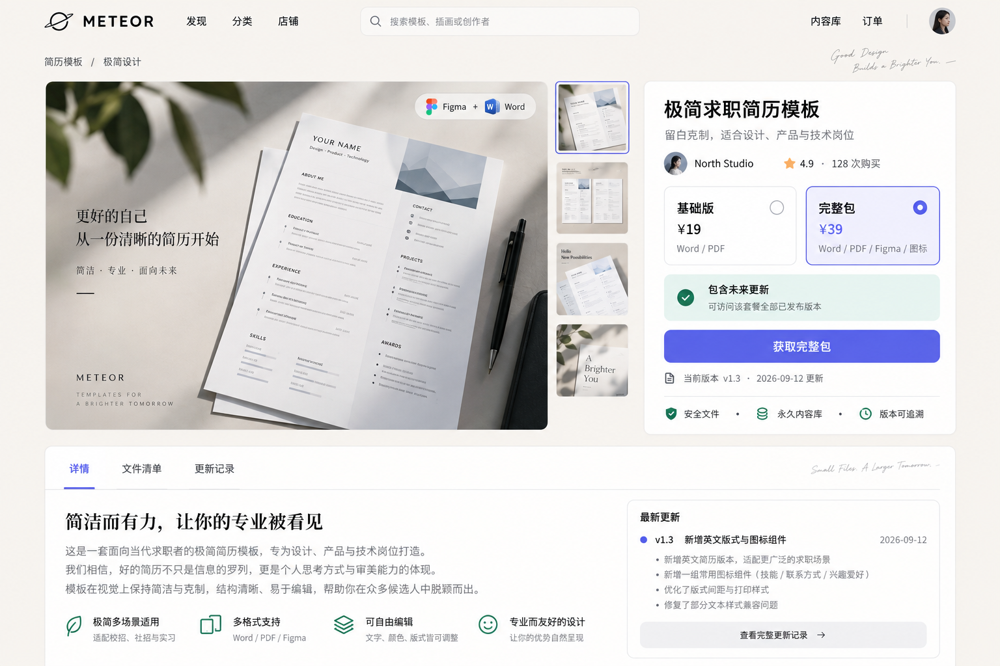
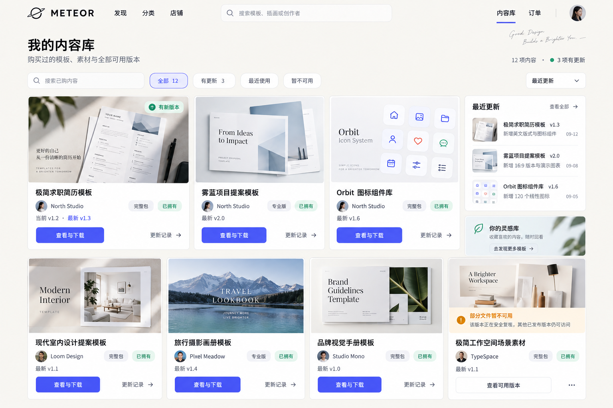
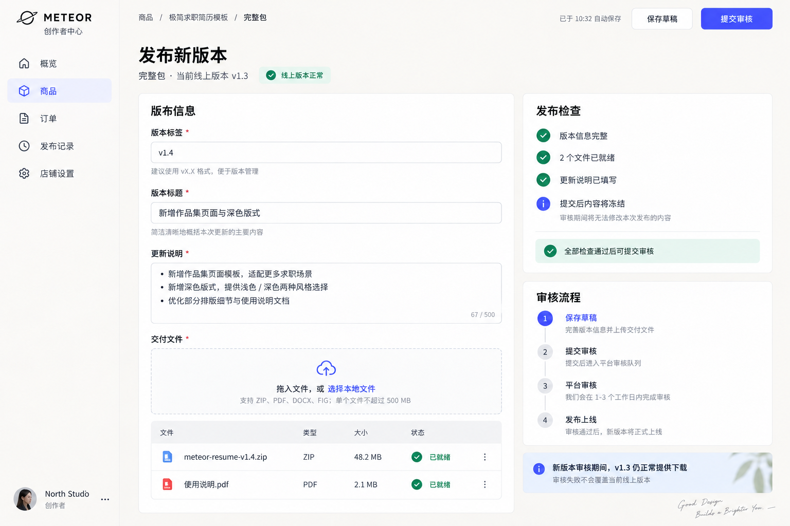

# Meteor 页面与视觉设计方案 V0.1

日期：2026-09-18。状态：历史视觉方案。首页已采用独立 `frontend/` 工程重新设计；本文中的页面效果图不再作为首页视觉基准，核心业务说明仍可参考。

本方案服务于“模板与视觉素材的多商家数字商品平台”。设计目标不是做一个促销信息密集的传统商城，而是让作品预览、版本价值和购买后的内容访问成为页面主角。

## 1. 核心视觉方向

关键词：**温和、清晰、有创作感、可信任**。

- 暖白背景降低后台系统的生硬感，商品卡片使用纯白承载内容。
- 界面主体保持克制，色彩主要来自商品预览图。
- 靛蓝色只用于主要操作、选中状态和链接；绿色只表达已拥有、可用、检查通过。
- 页面不使用倒计时、夸张折扣、巨型经营数字和无意义图表。
- 买家端突出作品，商家端突出流程，但两端共用颜色、字号、按钮和状态语言。

### 1.1 设计基准

| 项目 | 基准 |
| --- | --- |
| 页面背景 | `#F6F3EE` 暖白 |
| 卡片背景 | `#FFFFFF` |
| 主文字 | `#17181B` |
| 次文字 | `#6E7280` |
| 主色 | `#5B5CE2` 靛蓝 |
| 成功／可用 | `#178866` |
| 警告／复核 | `#D98918` |
| 边框 | `#E5E2DD`，1px |
| 正文字体 | HarmonyOS Sans SC、思源黑体或系统无衬线字体 |
| 展示标题 | 中文仍以清晰无衬线为主；商品预览内部可使用衬线字体 |
| 圆角 | 输入框 10px；按钮 10px；卡片 16px；大预览 20px |
| 间距 | 8px 基础网格，常用 8／16／24／32／48px |
| 内容宽度 | 买家端最大约 1400px；商家端为 216px 侧栏加自适应内容区 |

阴影只用于建立层级，不能用阴影代替边框。正文在普通背景上的颜色对比度应达到 WCAG AA；状态不能只依靠颜色，必须同时出现图标或文字。

## 2. 页面地图与开发优先级

### P0：先形成可演示闭环

1. 商品详情：让访客理解商品、套餐、版本和更新权益。
2. 内容库：让买家找到已购内容、版本和下载入口。
3. 商家发布：让商家创建新 Release，并理解审核期间旧版本仍可用。
4. 登录：提供进入买家与商家视图所需的最小身份入口。
5. 购买结果：表达待支付、核对中、已获得内容和异常待处理。

### P1：补齐完整体验

- 发现页、分类／搜索结果、店铺主页。
- 订单列表与订单详情。
- 商家商品列表、发布记录、本店订单。
- 管理员审核、退款与异常处理。

首页不应先于商品详情投入大量时间。首个可运行版本可以把商品详情作为主要演示入口，再复用商品卡片建设发现页。

## 3. 三个核心原型

### 3.1 商品详情

页面按“作品预览 → 套餐差异 → 更新承诺 → 行动”组织。

左侧约占 62%，展示统一比例的主预览与缩略图；右侧购买卡保持在首屏内。套餐选择必须显示包含内容，不能只写套餐名和价格。`包含未来更新` 的解释直接使用业务规则：可访问所购套餐全部已发布且未禁用的版本。

主要状态：

| 状态 | 页面行为 |
| --- | --- |
| 正常可售 | 可切换套餐，主按钮为“获取完整包”或对应套餐名 |
| 已拥有 | 显示“已拥有”，主按钮改为“前往内容库” |
| 暂停销售 | 套餐不可选，保留详情与版本信息，不显示虚假库存紧张 |
| 商品不存在／未发布 | 使用独立空状态，不渲染残缺购买卡 |
| 加载失败 | 保留页面框架并提供重试，不能把后端异常栈展示给用户 |

### 3.2 我的内容库

内容库不是购买历史列表。卡片优先显示商品预览、所购套餐、当前可用版本、是否有更新和进入下载页的动作；价格与再次购买按钮不出现。

筛选包括全部、有更新、最近使用、暂不可用。文件被禁用时说明影响范围，并继续提供其他允许访问的历史版本。退款导致资格被撤销时，卡片进入历史记录视图，明确原因并移除下载操作。

### 3.3 商家发布新版本

页面分为左侧编辑区和右侧状态区。商家需要填写版本标签、版本标题和更新说明，上传文件并查看 manifest。右侧持续说明发布检查与审核步骤。

最关键的产品承诺固定展示：**新版本审核期间，当前线上版本仍正常提供下载；审核失败不会覆盖当前线上版本。** 这既降低商家操作焦虑，也与后端的不可变 Release 模型一致。

主要状态：草稿未完整、文件上传中、文件处理失败、可提交审核、审核中、驳回并展示原因、已发布。提交审核后本次候选内容冻结；商家要修改时回到草稿流程，而不是原地篡改审核内容。

## 4. 公共组件

第一阶段只建立能被三个页面复用的组件，不先建设庞大的通用组件库。

| 组件 | 用途 |
| --- | --- |
| BuyerHeader | 买家端导航、搜索、内容库与订单入口 |
| CreatorSidebar | 商家端导航与当前店铺身份 |
| ProductPreview | 统一比例的商品主图与缩略图 |
| PackageSelector | 套餐内容、价格、选中与不可售状态 |
| StatusBadge | 已拥有、有更新、线上正常、复核中等短状态 |
| PrimaryButton／SecondaryButton | 页面唯一主操作与次操作 |
| VersionSummary | 版本标签、更新时间与更新说明摘要 |
| ProductCard | 发现页和内容库的基础商品展示，按场景隐藏价格或下载动作 |
| EmptyState／ErrorState | 空列表、404、加载失败及重试 |
| FileDropzone／FileManifest | 文件选择、上传进度、处理结果和 manifest |
| ReviewTimeline | 草稿、提交、审核、发布过程 |

同一屏通常只有一个高强调主按钮。删除、撤销和退款不使用主色伪装成普通前进操作。

## 5. 交互与响应式规则

- 1440px 以上：商品详情保持左右双栏，内容库三列加更新侧栏。
- 1024—1439px：缩小空白，内容库改为三列且更新面板移到列表上方。
- 768—1023px：商品详情改为预览在上、购买卡在下；商家侧栏收起为图标栏。
- 低于 768px：卡片单列、主按钮可吸附底部；表格改为文件卡片，不能依赖横向滚动完成核心操作。
- 弹窗仅用于短确认；复杂发布、退款和订单详情使用独立页面。
- 加载时使用与真实布局一致的骨架屏，避免整页旋转图标。
- 成功反馈说明结果和下一步；失败反馈说明用户能做什么，不直接显示数据库或 Java 异常。

## 6. 视觉稿使用边界

三张图是布局和风格基准，不是要求逐像素复制的截图。实现时以真实中文、真实状态和可访问性为准；视觉稿中的商品图片属于概念素材，正式演示应替换为自制或获准使用的文件预览。

实现前先固定以下内容，避免边写边换风格：颜色变量、文字层级、按钮高度、卡片圆角、预览比例、页面最大宽度和状态词表。随后按“静态真实数据 → 接口数据 → 加载／空／错／权限状态 → 响应式”的顺序完成页面。

## 7. 第一阶段验收

- 三个核心页面在 1440px 宽度下具有一致的品牌、网格和组件外观。
- 商品详情能在十秒内让用户找到套餐区别、价格、当前版本和更新规则。
- 内容库不借助订单页即可说明用户拥有什么、能下载哪个版本。
- 商家发布页能明确区分草稿、审核候选和当前线上版本。
- 键盘可到达主要控件，焦点样式清晰；文本、图标与状态不是纯装饰。
- 正常、加载、空、错误、不可用状态都有设计，不只实现最理想截图。
